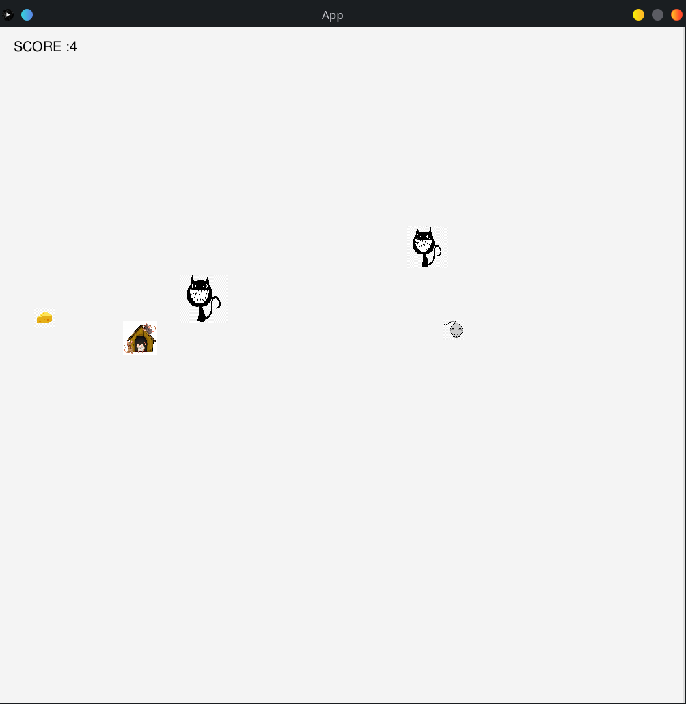

# Mouse & Cat

## Kurzbeschreibung

Das Spiel heißt "Mouse and Cat". Die Katze versucht, die Maus (der Spieler) zu fressen
und die Maus versucht, so viel Käse zu sammeln, wie sie kann. Die Maus versucht,
in ihrem Haus zu verstecken, sodass die Katze sie nicht sehen oder fressen kann.
Je mehr Käse gesammelt wird, desto schwieriger wird das Spiel. Wie viel Käse kannst du sammeln, bevor du gefressen wurde.

## Technologien
- Java
- Processing
- gradle

## Screenshot

## Bedienungshinweise
mit `gradle run`  und mit `gradle test` die Testfälle ausführen
## Dateiübersicht und Lines of Code
<pre>
\.gradle
\gradle
\README.md
\Screenshot.png
\gradlew
\gradlew.bat
\settings.gradle
\app\build.gadle
\app\core.jar
\app\src\main\java\project\App.java
\app\src\main\java\project\Cat.java
\app\src\main\java\project\Cave.java
\app\src\main\java\project\Cheese.java
\app\src\main\java\project\Logic.java
\app\src\main\java\project\FieldObject.java
\app\src\main\java\project\Mouse.java
\app\src\main\java\project\Pet.java
\app\src\main\java\project\World.java
\app\src\main\resources\cat.jpg
\app\src\main\resources\cheese.jpg
\app\src\main\resources\house.jpg
\app\src\main\resources\mouse.jpg
\app\src\test\java\project\AppTest.java
\app\src\test\resources

The whole Project :
-------------------------------------------------------------------------------
Language                     files          blank        comment           code
-------------------------------------------------------------------------------
HTML                             3              0              0            372
Java                            10            160              0            355
CSS                              2             49              0            214
JavaScript                       1             45              1            148
Bourne Shell                     1             23             36            126
DOS Batch                        1             21              2             66
Markdown                         1              2              0             33
Gradle                           2              8             21             20
XML                              1              0              0             15
-------------------------------------------------------------------------------
SUM:                            22            308             60           1349
-------------------------------------------------------------------------------

the Java Files :

-------------------------------------------------------------------------------------
File                                    blank        comment           code
--------------------------------------------------------------------------------------

project/App.java                           40              0            106

project/World.java                         27              0             51
project/FieldObject.java                   12              0             30
project/Cat.java                           16              0             28
project/Pet.java                            5              0             17
project/Cheese.java                         7              0             16
project/Mouse.java                         10              0             13
project/Cave.java                           3              0              6
project/Logic.java                          2              0              4

--------------------------------------------------------------------------------------
SUM:                                      122              0            271
--------------------------------------------------------------------------------------
</pre>

## Verwendete Quellen
* main website for processing : https://processing.org/reference/     (Abruf,01.07.2021)
* using the keyboard to move in processing : https://www.youtube.com/watch?v=nermdWNIhm0   (Abruf,01.07.2021)
* Solving some Issues with moving  : https://stackoverflow.com/ (Abruf,01.07.2021)
